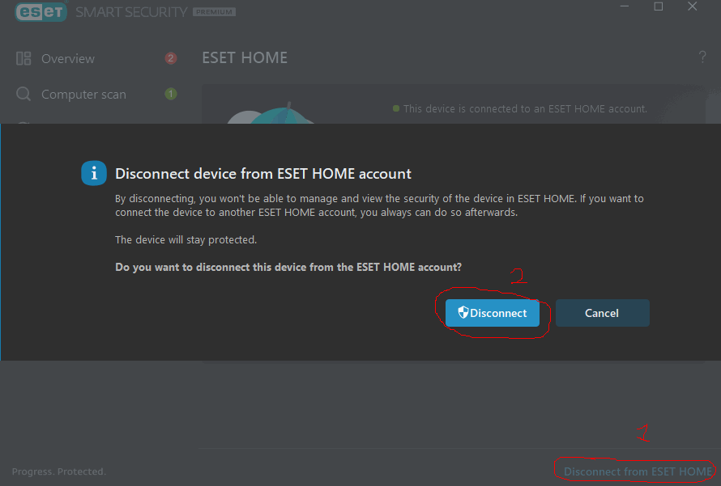

# ESET-KeyGen
ESET-KeyGen - Trial-Key & Account generator for ESET Antivirus (last test was on 28.01.2024 at 10:15 UTC+2)

---
# My github page is currently blocked by ESET Antivirus, so you will not be able to access the project.
## Before you can access my github page, you need to disable internet protection in Eset Antivirus. You now have access to this release! After you have done everything you want to do, turn internet protection back on.
### [The second way around this](wiki/GithubWorkaround.md)
---

# How to use

## Using GitHub Actions CI
You can simply use the GitHub actions workflow given [here](https://github.com/rzc0d3r/ESET-KeyGen/blob/main/.github/workflows/eset.yml) in your GitHub repo.

Add the workflow file to your GitHub repo. Then goto the **Actions** tab, choose **ESET Keys & Accounts Generator (MAIN)** actions and then run the workflow.

It will ask the number of accounts and licenses to be generated. If you don't want to generate one of them, enter **0** as the answer.

## Using your Computer

### Installing Google Chrome / Firefox
#### Google Chrome

1. [How to install Chrome on Windows](https://support.google.com/chrome/answer/95346?hl=en&co=GENIE.Platform%3DDesktop#zippy=%2Cwindows)
2. [How to install Chrome on Linux](https://support.google.com/chrome/answer/95346?hl=en&co=GENIE.Platform%3DDesktop#zippy=%2Clinux)
3. [How to install Chrome on Mac](https://support.google.com/chrome/answer/95346?hl=en&co=GENIE.Platform%3DDesktop#zippy=%2Clinux%2Cmac)

#### Firefox
1. [How to install Firefox on Windows](https://support.mozilla.org/en-US/kb/how-install-firefox-windows)
2. [How to Install Firefox on Linux](https://support.mozilla.org/en-US/kb/install-firefox-linux)
3. [How to Install Firefox on Mac](https://support.mozilla.org/en-US/kb/how-download-and-install-firefox-mac)

#### Microsoft Edge (The project fully supports it only on Windows)
1. [Download](https://www.microsoft.com/en-us/edge/download?form=MA13L8)

### Installing python and libraries

> You can skip this step if you use the compiled .exe file from the release

1. Go to the official [Python website](https://www.python.org/downloads) and download the version for your system (the project runs starting with [Python 3.8.0](https://www.python.org/downloads/release/python-380))

2. Next, install/upgrade the Python libraries, in terminal using requirements.txt:

```
pip install -r requirements.txt
```

Or without requirements.txt:

```
pip install selenium requests colorama typing-extensions
```

## Preparing ESET
Delete your current ESET HOME account



## Using the repository
1. [Account Generator](wiki/AccountGenerator.md)
2. [Key Generator](wiki/KeyGenerator.md)
3. [Command Line Arguments](wiki/CommandLineArguments.md)

# Recommendations and information

1. It is recommended to run the project as a non-administrator or root user.
2. Do not minimize or close the browser window before the program is finished!!!
3. Do not create many license keys and accounts in a short period of time, otherwise you will be blocked in ESET HOME for a certain period of time
4. If the program crashes after many attempts and you know that the program is up to date. Try using a VPN
5. If an ACT0 error occurs during activation, check whether the ESET HOME account is connected. If so, disconnect it and try again.
   If the error persists, try activating with [Account Generator](https://github.com/rzc0d3r/ESET-KeyGen/blob/main/wiki/AccountGenerator.md).
   If still getting this error reinstall ESET and try again.
6. Found an activation error under the code ecp4125, which appears when you try to activate the antivirus with an account.
   Perhaps not everyone has it error, but still try it, and if it does not work, use the keys. 
7. You can test the argument ```--skip-webdriver-menu``` theoretically the program itself will install the browser and web driver to it!
